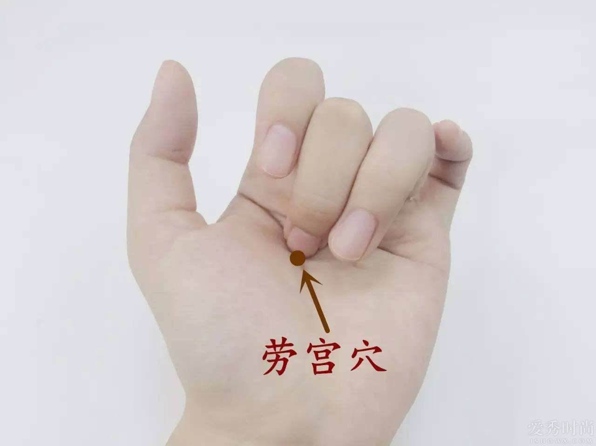

# 劳宫穴

自古以来，劳宫穴就是医家治疗神志与心病的特效穴，举凡失眠、抑郁、心烦、神经衰弱等困扰，经常点按劳宫穴都能帮上忙。

劳意指劳作，宫则是宫殿，劳宫穴是手厥阴心包经的荥穴。心包经主治胸腔、心脏、胃、神志方面病症，作用是保护心脏；荥穴则代表脉气从此处开始增强，因此刺激劳宫穴有助强化心包经，减少外邪对心脏的伤害，从而泄心火，让思维恢复清晰，焦急、浮躁的情绪也得以重现平和。

古装剧中常可见某些角色手握两颗核桃或圆球在掌心打转，看似无聊之举，其实这个动作正可刺激劳宫穴，收到养身健体之效。

## 功效

劳宫穴位于手掌的胃肠反射区，体质偏热、口干舌燥、尿量少、常便秘的人，平日可用拇指以旋转方式按压另一掌劳宫穴约30秒，其余四指则放在手背后支撑，直到掌心产生微热感，有助和胃祛湿、增强体质。

尤其在每日清晨7点，人体气血循行节律正从大肠经转至胃经，此时按摩劳宫穴一会儿，可促进肠胃蠕动，进而缓解便秘困扰。

## 位置

握拳屈指，中指指尖对应的掌心中央位置即为劳宫穴，双手各一。

## 适应症

心绞痛、呕吐、口疮、手汗、手指麻木、手掌搔痒、中暑

## 自我按摩

以拇指指尖、指腹按另一手劳宫穴至略感酸麻。每日早晚、左右手各按1～3分钟，可改善手麻、手部冰冷。

午后轻按劳宫穴2分钟，可纾缓心脏疲劳，提神醒脑、摆脱昏昏欲睡。

## 温灸建议

利用零碎时间徒手按揉温热即可；睡前可将两手劳宫穴互相摩擦，促进睡眠。年长者可坐下，用掌心的劳宫穴搓脚心的涌泉穴，同时刺激劳宫、涌泉两穴可使心肾相交，改善老年人常见的失眠、高血压症状。
