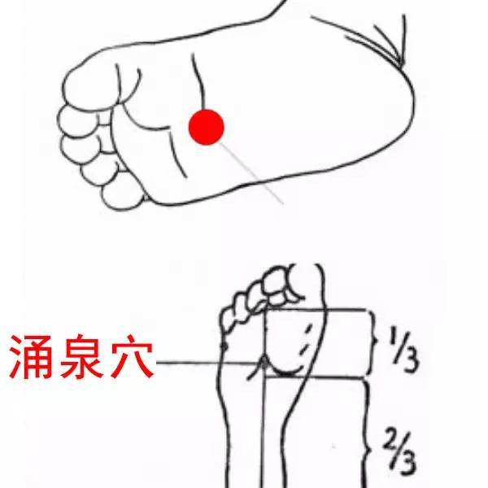

# 涌泉穴

推搓涌泉穴俗称“搓脚心”，它是我国流传已久的自我养生保健按摩疗法之一。涌泉穴归属足少阴肾经，有缓解治疗神经衰弱、精力减退、倦怠感、妇女病、失眠等作用功效

## 位置

涌泉穴的位置：位于足前部凹陷处第 2、3 趾趾缝纹头端与足跟连线的前三分之一处。

## 功效

1. 轻轻点按涌泉穴能通过经络传递作用，调节你的植物神经系统，帮你扩张血管、促进皮肤血液循环、加快毒素排出、降低血液粘稠度。

2. 活跃肾经内气、固本培元、延年益寿、散热生气，有使肾精充足，耳聪目明，发育正常，精力充沛，性功能强盛，腰膝壮实不软，行走有力等。

3. 缓解治疗神经衰弱、精力减退、倦怠感、妇女病、失眠、多眠症、高血压、晕眩、焦躁、糖尿病、过敏性鼻炎、更年期障碍、怕冷症、肾脏病等。

4. 缓解治疗头顶痛，头晕，眼花，咽喉痛，舌干，失音，小便不利，大便难，小儿惊风，足心热，癫疾，霍乱转筋，昏厥等。

5. 治疗老年性的哮喘、腰腿酸软无力、耳聋、耳鸣等。

## 自我按摩

1. 用热盐水浸泡双侧涌泉穴。热水以自己能适应为度，加少许食盐，每日临睡觉前浸泡 15 ～ 30 分钟。

2. 用艾灸或隔药物灸，每日一次，至涌泉穴有热感上行为度。

3. 用按摩手法推搓、拍打涌泉穴：在床上取坐位，双脚自然向上分开，或取盘腿坐位。然后用双拇指从足跟向足尖方向涌泉穴处，作前后反复的推搓；或用双手掌自然轻缓的拍打涌泉穴，最好以足底部有热感为适宜。

4. 摩擦涌泉穴：端坐于椅子上，先将右脚架在左腿上，以右手握着脚趾，再用左手掌摩擦右脚心的涌泉穴，直至脚心发热。再将左脚架在右腿上，以左手掌摩擦右脚心的涌泉穴，也是摩擦到脚心发热为止。

5. 取自然体位、仰卧位或俯卧位，用自己双脚作相互交替的对搓动作，可也用脚心蹬搓床头或其他器械。
